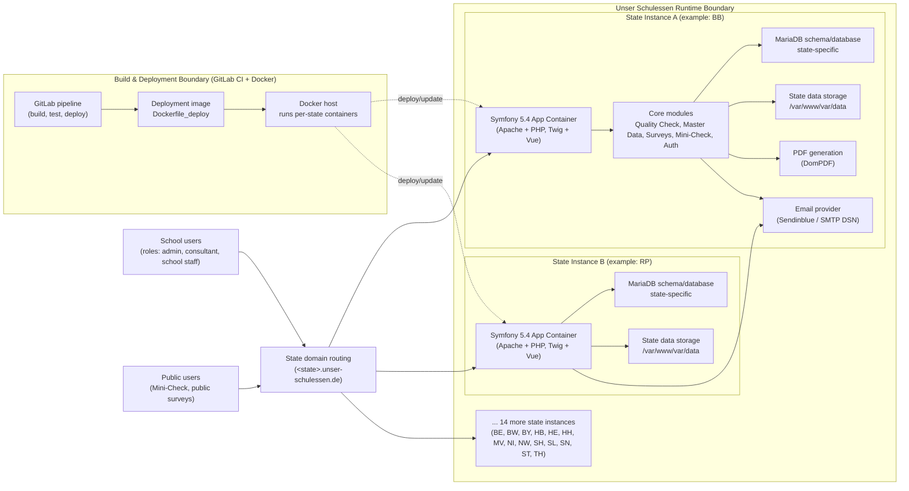
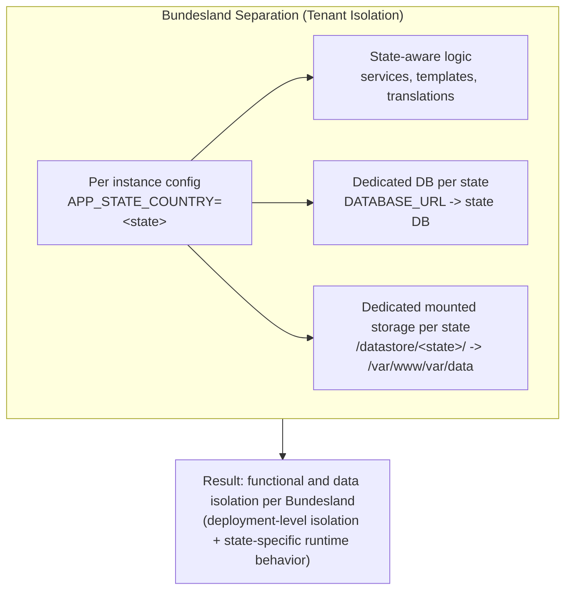

# Architecture Overview (One-Page)

This page provides a one-page architecture view of **Unser Schulessen** with:
- system boundaries,
- major components,
- main data paths,
- deployment topology,
- and federal-state separation.

## 1) System + Deployment View

## 2) Federal-State Separation Model

## 3) Main Data Paths (Condensed)

1. User request enters via state domain (`<state>.unser-schulessen.de`) and reaches the matching state container.
2. Symfony controllers/services process module logic (Quality Check, Master Data, Surveys, Mini-Check, Auth).
3. Persistent data is read/written only to that state’s MariaDB database.
4. Generated artifacts (documents, uploads, exports) are stored in that state’s mounted data directory.
5. Outbound notifications are sent via configured mail provider (`MAILER_DSN`).
6. CI/CD builds once, then deploys multiple state-specific runtime instances with separate env vars and storage/database bindings.

## 4) Source Basis

This diagram is derived from:
- `/README/TECHNICAL_DOCUMENTATION.md`
- `/README/DATABASE_ERD.md`
- `/.gitlab-ci.yml`
- `/docker-compose.yml`
- `/config/services.yaml`
- `/src/Kernel.php`
- `/.env.dist`
