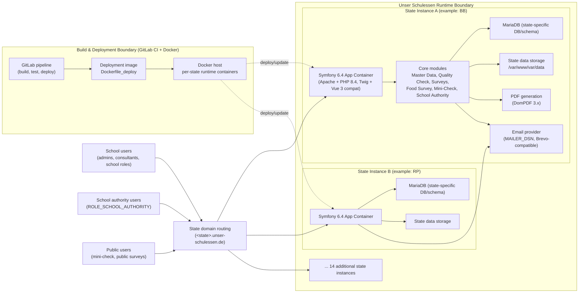
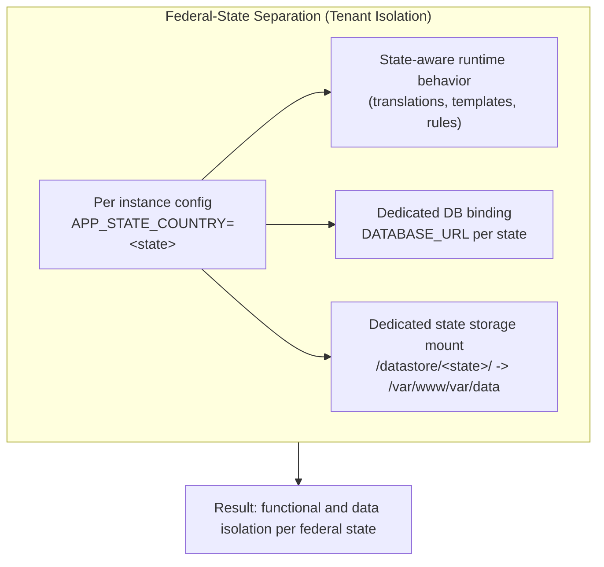

# Architecture Overview (One-Page)

This page provides a one-page architecture view of **Unser Schulessen** with:
- system boundaries,
- major components,
- main data paths,
- deployment topology,
- and federal-state separation.

## 1) System + Deployment View

```mermaid
flowchart LR
    su["School users<br/>(admins, consultants, school roles)"]
    sa["School authority users<br/>(ROLE_SCHOOL_AUTHORITY)"]
    pu["Public users<br/>(mini-check, public surveys)"]
    smtp["Email provider<br/>(MAILER_DSN, Brevo-compatible)"]

    dns["State domain routing<br/>(&lt;state&gt;.unser-schulessen.de)"]

    su --> dns
    sa --> dns
    pu --> dns

    subgraph runtime["Unser Schulessen Runtime Boundary"]
        direction LR

        subgraph stateA["State Instance A (example: BB)"]
            direction TB
            appA["Symfony 6.4 App Container<br/>(Apache + PHP 8.4, Twig + Vue 3 compat)"]
            modA["Core modules<br/>Master Data, Quality Check, Surveys,<br/>Food Survey, Mini-Check, School Authority"]
            dbA["MariaDB (state-specific DB/schema)"]
            fsA["State data storage<br/>/var/www/var/data"]
            pdfA["PDF generation<br/>(DomPDF 3.x)"]

            appA --> modA
            modA --> dbA
            modA --> fsA
            modA --> pdfA
            modA --> smtp
        end

        subgraph stateB["State Instance B (example: RP)"]
            direction TB
            appB["Symfony 6.4 App Container"]
            dbB["MariaDB (state-specific DB/schema)"]
            fsB["State data storage"]

            appB --> dbB
            appB --> fsB
            appB --> smtp
        end

        more["... 14 additional state instances"]
    end

    dns --> appA
    dns --> appB
    dns --> more

    subgraph cicd["Build & Deployment Boundary (GitLab CI + Docker)"]
        direction TB
        ci["GitLab pipeline<br/>(build, test, deploy)"]
        img["Deployment image<br/>Dockerfile_deploy"]
        host["Docker host<br/>per-state runtime containers"]

        ci --> img --> host
    end

    host -. deploy/update .-> appA
    host -. deploy/update .-> appB
```

## 2) Federal-State Separation Model

```mermaid
flowchart TB
    subgraph separation["Federal-State Separation (Tenant Isolation)"]
        direction LR
        cfg["Per instance config<br/>APP_STATE_COUNTRY=&lt;state&gt;"]
        code["State-aware runtime behavior<br/>(translations, templates, rules)"]
        data["Dedicated DB binding<br/>DATABASE_URL per state"]
        files["Dedicated state storage mount<br/>/datastore/&lt;state&gt;/ -> /var/www/var/data"]

        cfg --> code
        cfg --> data
        cfg --> files
    end

    note["Result: functional and data isolation per federal state"]
    separation --> note
```

## 3) Main Data Paths (Condensed)

1. Browser request goes to `<state>.unser-schulessen.de` and lands on the matching state runtime.
2. Symfony controllers/services process role-specific workflows (school, admin, public, school authority).
3. Doctrine reads/writes only to the bound state database.
4. Uploads/documents/exports are stored in that state instance's mounted data directory.
5. Notifications are sent through configured mail transport (`MAILER_DSN`).
6. CI/CD builds once and deploys state-specific runtime instances with separate env and DB/storage bindings.

## 4) Source Basis

- `/README/TECHNICAL_DOCUMENTATION.md`
- `/README/DATABASE_ERD.md`
- `/.gitlab-ci.yml`
- `/docker-compose.yml`
- `/config/services.yaml`
- `/src/Kernel.php`
- `/.env.dist`
