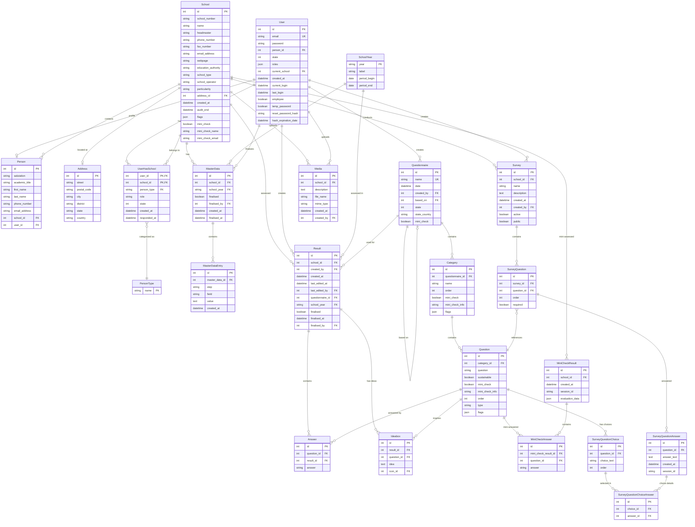
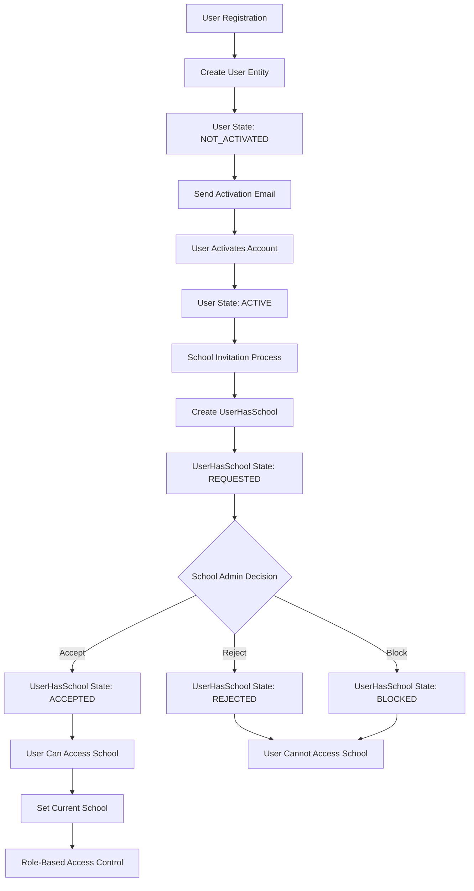
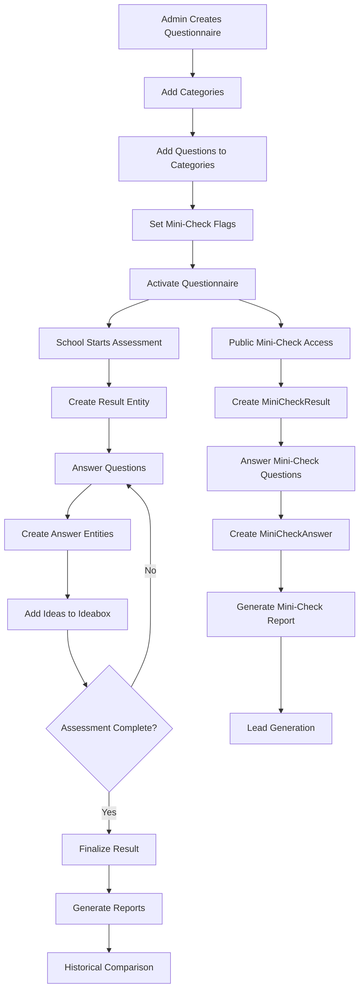
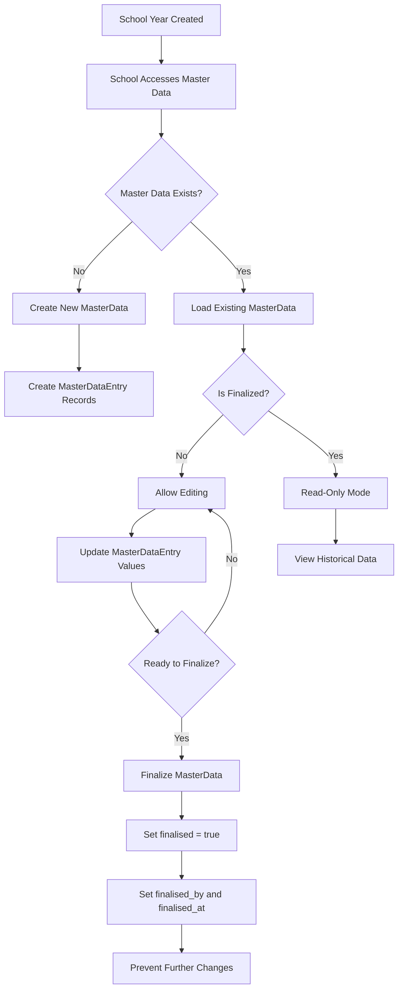

# Database Entity Relationship Diagram - Unser Schulessen

## Complete System ERD



## Data Flow Diagrams

### User Registration and School Association Flow



### Quality Check Assessment Flow



### Master Data Management Flow



## Database Constraints and Business Rules

### Unique Constraints

```sql
-- User email must be unique across the system
ALTER TABLE user ADD CONSTRAINT uk_user_email UNIQUE (email);

-- Questionnaire names must be unique
ALTER TABLE questionnaire ADD CONSTRAINT uk_questionnaire_name UNIQUE (name);

-- One user-school relationship per pair
ALTER TABLE user_has_school ADD CONSTRAINT uk_user_school 
    UNIQUE (user_id, school_id);

-- One master data set per school per year
ALTER TABLE master_data ADD CONSTRAINT uk_school_year 
    UNIQUE (school_id, school_year);

-- Questions must be unique within categories
ALTER TABLE question ADD CONSTRAINT uk_category_question 
    UNIQUE (category_id, question);

-- One answer per question per result
ALTER TABLE answer ADD CONSTRAINT uk_question_result 
    UNIQUE (question_id, result_id);
```

### Foreign Key Constraints with Cascade Rules

```sql
-- User deletion cascades to UserHasSchool
ALTER TABLE user_has_school 
    ADD CONSTRAINT fk_user_cascade 
    FOREIGN KEY (user_id) REFERENCES user(id) ON DELETE CASCADE;

-- School deletion cascades to related data
ALTER TABLE user_has_school 
    ADD CONSTRAINT fk_school_cascade 
    FOREIGN KEY (school_id) REFERENCES school(id) ON DELETE CASCADE;

-- Restrict deletion of referenced entities
ALTER TABLE result 
    ADD CONSTRAINT fk_created_by_restrict 
    FOREIGN KEY (created_by) REFERENCES user(id) ON DELETE RESTRICT;

-- Set null when referenced entity is deleted
ALTER TABLE school 
    ADD CONSTRAINT fk_address_set_null 
    FOREIGN KEY (address_id) REFERENCES address(id) ON DELETE SET NULL;
```

### Check Constraints for Data Integrity

```sql
-- User state validation
ALTER TABLE user ADD CONSTRAINT chk_user_state 
    CHECK (state IN (0, 1, 2));

-- UserHasSchool state validation
ALTER TABLE user_has_school ADD CONSTRAINT chk_uhs_state 
    CHECK (state IN (0, 1, 2, 3, 4));

-- Answer value validation
ALTER TABLE answer ADD CONSTRAINT chk_answer_value 
    CHECK (answer IN ('true', 'partial', 'false') OR answer IS NULL);

-- Questionnaire state validation
ALTER TABLE questionnaire ADD CONSTRAINT chk_questionnaire_state 
    CHECK (state IN (0, 1, 2));
```

## Indexing Strategy

### Performance Indexes

```sql
-- Composite indexes for common queries
CREATE INDEX idx_user_has_school_state ON user_has_school(user_id, state);
CREATE INDEX idx_result_school_year ON result(school_id, school_year);
CREATE INDEX idx_answer_result_question ON answer(result_id, question_id);
CREATE INDEX idx_master_data_school_year ON master_data(school_id, school_year);

-- Indexes for foreign key lookups
CREATE INDEX idx_person_school ON person(school_id);
CREATE INDEX idx_person_user ON person(user_id);
CREATE INDEX idx_category_questionnaire ON category(questionnaire_id);
CREATE INDEX idx_question_category ON question(category_id);

-- Indexes for filtering and sorting
CREATE INDEX idx_user_created_at ON user(created_at);
CREATE INDEX idx_school_mini_check ON school(mini_check);
CREATE INDEX idx_question_mini_check ON question(mini_check);
CREATE INDEX idx_result_finalised ON result(finalised, created_at);

-- Full-text search indexes
CREATE FULLTEXT INDEX idx_school_name_search ON school(name, headmaster);
CREATE FULLTEXT INDEX idx_question_text_search ON question(question);
```

### Query Optimization Examples

```sql
-- Optimized query for user's schools with accepted status
SELECT s.*, a.city, a.postal_code
FROM school s
JOIN user_has_school uhs ON s.id = uhs.school_id
LEFT JOIN address a ON s.address_id = a.id
WHERE uhs.user_id = ? AND uhs.state = 1
ORDER BY s.name;

-- Optimized query for questionnaire results with pagination
SELECT r.*, s.name as school_name, u.email as created_by_email
FROM result r
JOIN school s ON r.school_id = s.id
JOIN user u ON r.created_by = u.id
WHERE r.questionnaire_id = ? AND r.school_year = ?
ORDER BY r.created_at DESC
LIMIT 20 OFFSET ?;

-- Optimized query for mini-check questions
SELECT q.*, c.name as category_name
FROM question q
JOIN category c ON q.category_id = c.id
JOIN questionnaire qn ON c.questionnaire_id = qn.id
WHERE q.mini_check = 1 AND qn.state = 1 AND qn.state_country = ?
ORDER BY c.order, q.order;
```

## Data Archival and Retention

### Archival Strategy

```sql
-- Archive old results (older than 7 years)
CREATE TABLE result_archive AS SELECT * FROM result WHERE created_at < DATE_SUB(NOW(), INTERVAL 7 YEAR);
CREATE TABLE answer_archive AS SELECT * FROM answer WHERE result_id IN (SELECT id FROM result_archive);

-- Archive inactive users (not logged in for 2 years)
CREATE TABLE user_archive AS SELECT * FROM user WHERE last_login < DATE_SUB(NOW(), INTERVAL 2 YEAR) AND state != 1;

-- Archive completed surveys
CREATE TABLE survey_archive AS SELECT * FROM survey WHERE active = 0 AND created_at < DATE_SUB(NOW(), INTERVAL 1 YEAR);
```

### Data Retention Policies

| Entity | Retention Period | Archive Strategy |
|--------|------------------|------------------|
| User Activity Logs | 2 years | Monthly archival |
| Quality Check Results | 7 years | Annual archival |
| Survey Responses | 3 years | Quarterly archival |
| Master Data | Permanent | No archival |
| Media Files | 5 years | Annual cleanup |
| Mini-Check Results | 1 year | Monthly cleanup |

## Database Monitoring and Maintenance

### Performance Monitoring Queries

```sql
-- Monitor slow queries
SELECT query_time, lock_time, rows_sent, rows_examined, sql_text
FROM mysql.slow_log
WHERE start_time > DATE_SUB(NOW(), INTERVAL 1 DAY)
ORDER BY query_time DESC;

-- Monitor table sizes
SELECT 
    table_name,
    ROUND(((data_length + index_length) / 1024 / 1024), 2) AS 'Size (MB)',
    table_rows
FROM information_schema.tables
WHERE table_schema = DATABASE()
ORDER BY (data_length + index_length) DESC;

-- Monitor index usage
SELECT 
    table_name,
    index_name,
    cardinality,
    non_unique
FROM information_schema.statistics
WHERE table_schema = DATABASE()
ORDER BY table_name, cardinality DESC;
```

### Maintenance Tasks

```sql
-- Weekly maintenance tasks
OPTIMIZE TABLE user, school, result, answer;
ANALYZE TABLE user, school, result, answer;

-- Monthly cleanup tasks
DELETE FROM mini_check_result WHERE created_at < DATE_SUB(NOW(), INTERVAL 1 MONTH);
DELETE FROM survey_question_answer WHERE created_at < DATE_SUB(NOW(), INTERVAL 3 MONTH);

-- Quarterly statistics update
UPDATE TABLE user SET statistics_updated = NOW();
UPDATE TABLE school SET statistics_updated = NOW();
```